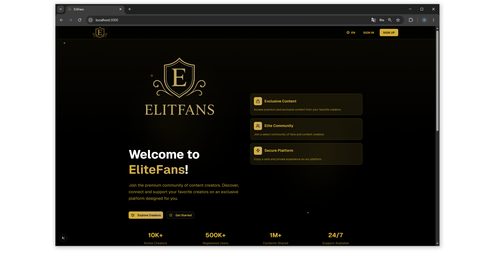
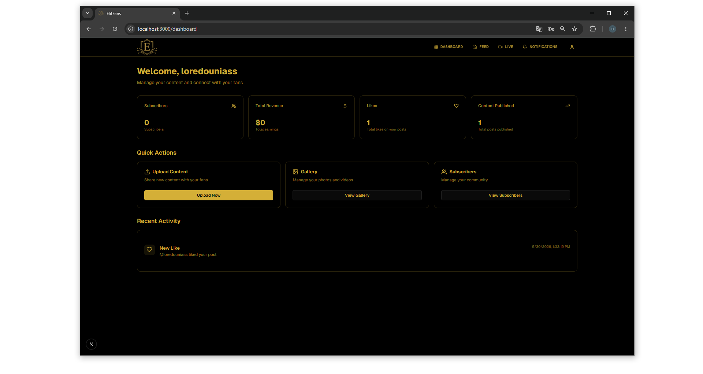
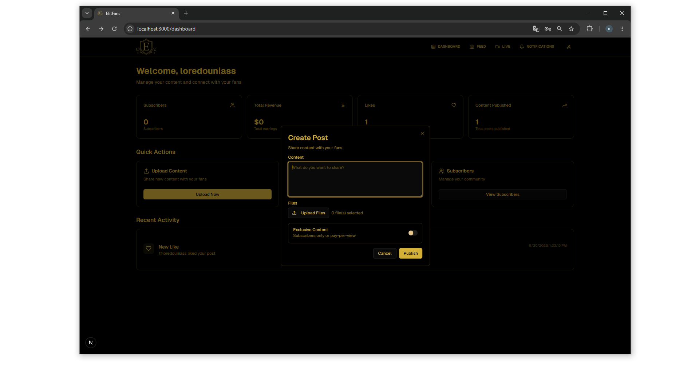
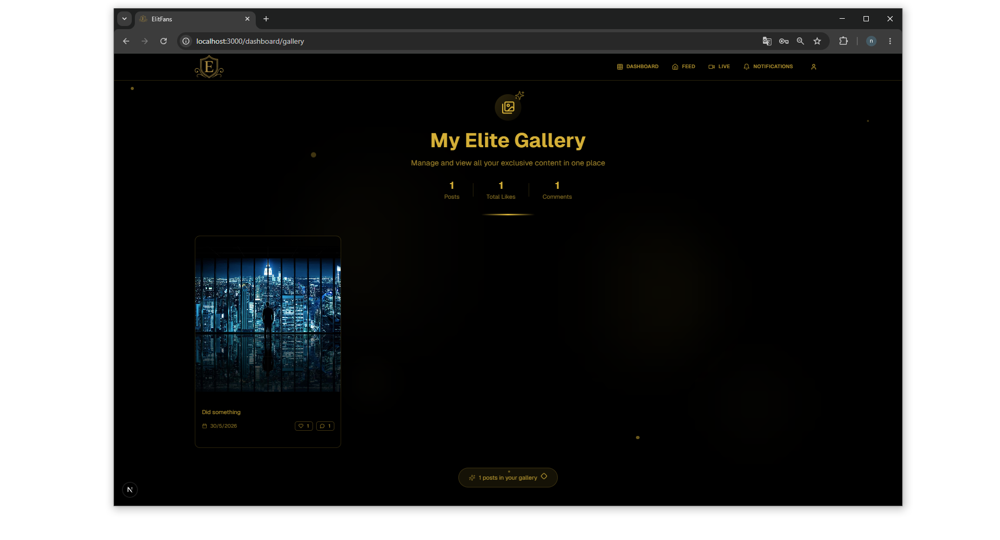
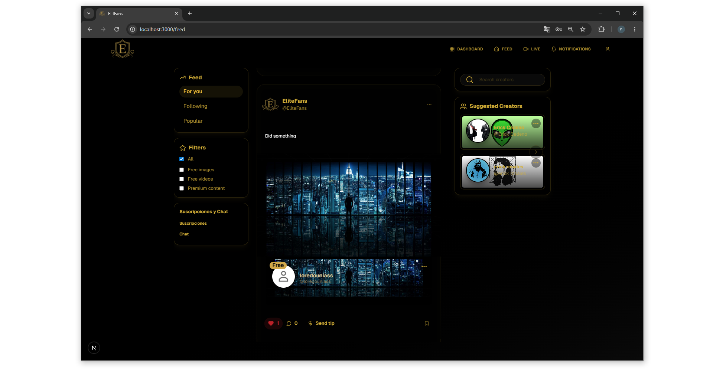
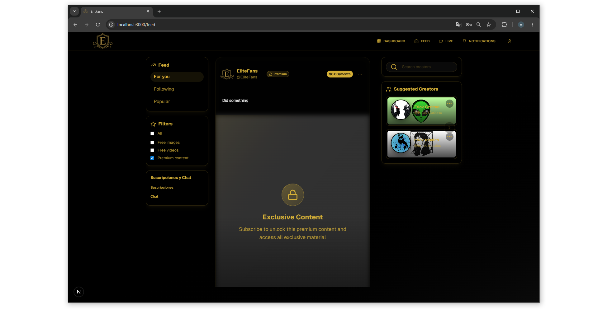
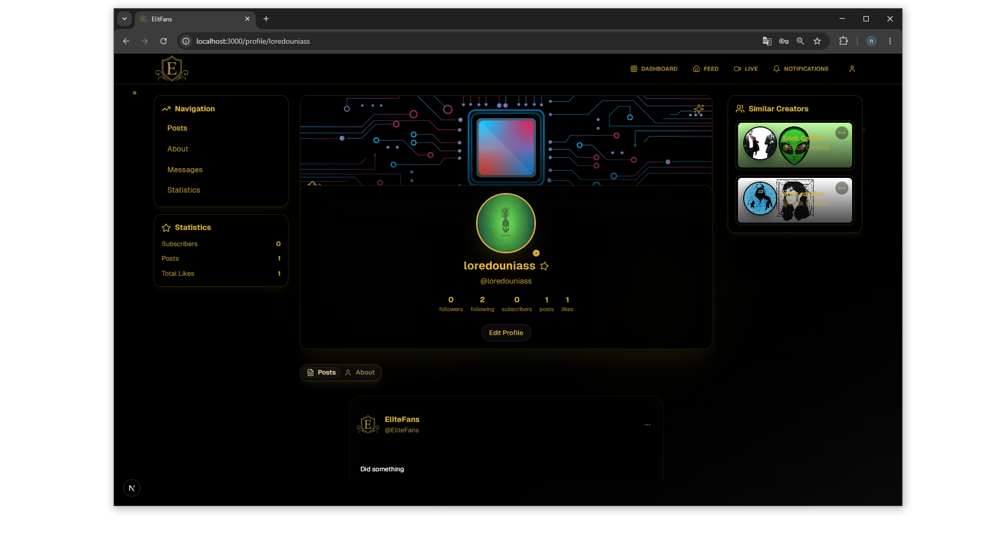

# ✨ EliteFans

**EliteFans** is a modern exclusive content platform where creators can publish premium posts, manage subscriptions, and connect with their audience. Built with **Next.js 15**, **Supabase**, and **TypeScript**, it offers a sleek, dark-themed UI with real-time features, role-based access control, and secure media uploads.

---

## 📸 Screenshots

| | | |
|:-:|:-:|:-:|
| **Home** | **Dashboard** | **Post Creation** |
|  |  |  |
| **Gallery** | **Feed** | **Feed — Exclusive Content** |
|  |  |  |
| **Profile** | | |
|  | | |

---

## 📋 Table of Contents

- [Prerequisites](#prerequisites)
- [Installation](#installation)
- [Environment Variables](#environment-variables)
- [Supabase Setup](#supabase-setup)
- [Local Development](#local-development)
- [Build & Deploy](#build--deploy)
- [Troubleshooting](#troubleshooting)
- [Useful Links](#useful-links)

---

## 🔧 Prerequisites

Make sure you have the following installed:

- **Node.js** >= 18 — [nodejs.org](https://nodejs.org/)
- **pnpm** — Install with `npm i -g pnpm`
- A **Supabase** account — [supabase.com](https://supabase.com/)
- A code editor (VS Code recommended)

---

## 📦 Installation

```bash
git clone <your-repo-url>
cd eliteFans
pnpm install
```

---

## 🔐 Environment Variables

Create a `.env.local` file at the project root with the following variables (values from your Supabase project):

```env
NEXT_PUBLIC_SUPABASE_URL=https://your-project-ref.supabase.co
NEXT_PUBLIC_SUPABASE_ANON_KEY=your-public-anon-key
SUPABASE_SERVICE_ROLE_KEY=your-service-role-key
NEXTAUTH_URL=http://localhost:3000
```

> `NEXT_PUBLIC_SUPABASE_URL` and `NEXT_PUBLIC_SUPABASE_ANON_KEY` are required.  
> `SUPABASE_SERVICE_ROLE_KEY` is optional and should be kept secret — use only on the server side.

---

## 🗄️ Supabase Setup

### 1) Create a Project

Create a new project in Supabase and note your project URL, anon key, and service role key.

### 2) Database Schema

Run the SQL scripts in `scripts/` in order via the Supabase SQL Editor:

- `00_create_media_tables.sql`
- `01_create_profiles_table.sql`
- `02_create_posts_table.sql`
- `03_create_subscriptions_table.sql`
- `04_create_likes_table.sql`
- `05_create_comments_table.sql`
- `06_create_transactions_table.sql`
- `07_create_messages_table.sql`
- `08_seed_sample_data.sql`
- `09_fix_profile_trigger.sql`
- `10_storage_policies.sql`

### 3) Storage

Create a bucket named `elitebucket` (or adjust the name in your code). Run `scripts/10_storage_policies.sql` to configure RLS for authenticated uploads. For production, consider using signed URLs.

### 4) Auth

Enable **Email/Password** in Supabase Auth settings. Optionally configure SMTP for email confirmations.

---

## 🚀 Local Development

install dependencies
```bash
pnpm install 
```

Start the dev server:
```bash
pnpm run dev
```

Open [http://localhost:3000](http://localhost:3000) in your browser.

---

## 🌐 Build & Deploy

- Deploy on **Vercel**, **Netlify**, or any platform supporting Next.js.
- Set the same environment variables in your platform's dashboard.
- Keep `SUPABASE_SERVICE_ROLE_KEY` out of client-side bundles.

---

## 🐛 Troubleshooting

| Problem | Solution |
|---------|----------|
| **Favicon not updating** | Clear browser cache or use an incognito window |
| **Storage upload RLS errors** | Run `scripts/10_storage_policies.sql` and adapt to your schema |
| **Auth errors** | Verify `NEXT_PUBLIC_SUPABASE_URL` and anon key are correct |

---

## 🔗 Useful Links

- [Next.js Documentation](https://nextjs.org/docs)
- [Supabase Documentation](https://supabase.com/docs)
- [Tailwind CSS](https://tailwindcss.com/) (used for styles)
